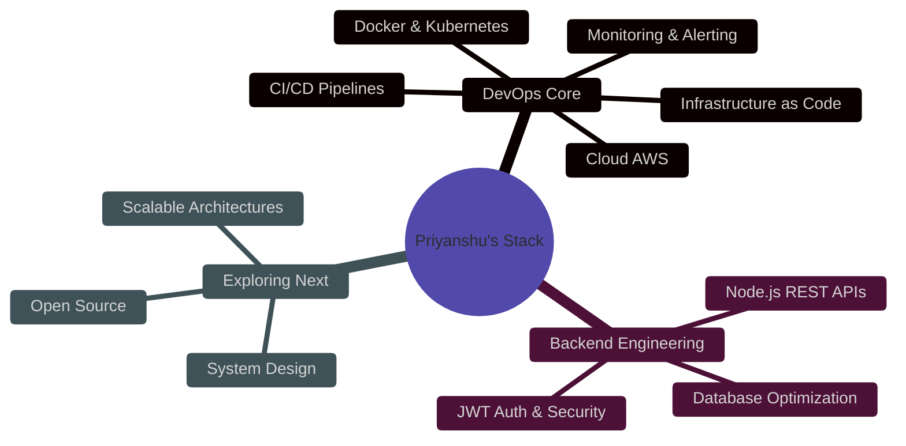

<p align="center">
  
</p>

<h1 align="center">
  
</h1>

---

## 🏅 My Holopin Badges

[](https://holopin.io/@priyanshu2545#badges)

---

## 🌐 Connect With Me

<p align="center">
  <a href="mailto:priyanshugarg2525@gmail.com" target="_blank">
    
  </a>
  <a href="https://linkedin.com/in/priyanshugarg2525" target="_blank">
    
  </a>
  <a href="https://github.com/priyanshugarg2525" target="_blank">
    
  </a>
</p>

---

## 🧠 About Me

```yaml
name      : Priyanshu Garg
role      : DevOps Engineer
college   : Geetanjali Institute of Technical Studies
degree    : B.Tech – Computer Science (Oct 2022 – May 2026)
cgpa      : 8.02
focus:
  - Cloud Infrastructure (AWS)
  - Container Orchestration (Docker + Kubernetes)
  - CI/CD Pipeline Automation
  - Monitoring & Observability
currently_exploring:
  - System Design at Scale
  - Open Source Contributions
  - Scalable Architectures
fun_fact  : "I turned a 2-hour deployment into 10 minutes. ⚡"
```

---

## 🛠️ Tech Arsenal

<details open>
<summary><b>☁️ DevOps & Cloud</b></summary>
<br>


</details>

<details open>
<summary><b>🔁 CI/CD & Automation</b></summary>
<br>


</details>

<details open>
<summary><b>📊 Monitoring & Observability</b></summary>
<br>


</details>

<details open>
<summary><b>⚙️ Backend & Databases</b></summary>
<br>


</details>

<details open>
<summary><b>💻 Frontend & Tools</b></summary>
<br>


</details>

---

## 🚀 Featured Projects

<table>
<tr>
<td width="50%" valign="top">

### 🔵 Cloud-Native CI/CD Pipeline
**Deployment time: 2 hrs → 10 mins ⚡**

`AWS EC2` `Docker` `Kubernetes` `Jenkins` `Nginx` `Prometheus` `Grafana`

- Built CI/CD with Jenkins & GitHub Webhooks
- Zero-downtime rolling updates on Kubernetes
- Nginx reverse proxy with pod-level load balancing
- Real-time CPU, memory & latency via Prometheus + Grafana

[](https://github.com/priyanshugarg2525)

</td>
<td width="50%" valign="top">

### 🟢 SUSTAINA – Resource Management System
**Live | Full-Stack + Real-time Dashboard**

`React.js` `Tailwind CSS` `Supabase` `PostgreSQL` `REST APIs`

- Track water & electricity usage with live dashboard
- Secure auth with Row Level Security (RLS)
- Interactive data visualization & usage insights
- Scalable real-time backend with data aggregation

[](https://github.com/priyanshugarg2525)

</td>
</tr>
<tr>
<td width="50%" valign="top">

### 🏆 SAMS – Smart Asset Monitoring System
**🥇 Winner – Smart India Hackathon 2024**

`Node.js` `Express.js` `MongoDB` `JWT` `REST APIs`

- GPS-based tracking for 10,000+ assets
- 80% reduction in operational cost via predictive monitoring
- JWT-secured APIs for enterprise-grade access control

</td>
<td width="50%" valign="top">

### 🛰️ GIS Pipeline Automation
**India Space Lab | Feb – Mar 2026**

`Linux` `PostgreSQL (PostGIS)` `Git` `Shell Scripting`

- Automated geospatial pipelines → 40% less manual effort
- Version-controlled pipeline scripts using Git
- Optimized PostGIS spatial queries for production

</td>
</tr>
</table>

---

## 🏅 Achievements & Certifications

| Badge | Achievement |
|:---:|---|
| 🥇 | **Winner** – Smart India Hackathon 2024 |
| 🥇 | **1st Place** – Hack-Avishkar by Google Developer Student Clubs |
| 🌍 | **Global Top 10K** – Hacktoberfest 2025 Super Contributor |
| ☁️ | **AWS Cloud Quest: Cloud Practitioner** (Apr 2026) |
| ☁️ | **AWS Certified** – EC2, VPC, RDS, DynamoDB |
| 🎓 | **Full Stack Web Development (MERN)** – Grras Solutions |
| 🤝 | **Core Member** – GDG Udaipur | Google DevFest 2024–25 (300+ attendees) |

---

## 💡 What I'm Up To



---

## ⚡ GitHub Stats

<div align="center">


</div>

---

<div align="center">

### 🤝 Let's Connect & Build Something Great

*"Infrastructure doesn't fail — it just finds creative ways to teach you."* 😄

<br/>


</div>


